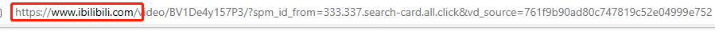
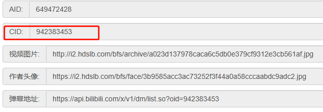

# Bilibili Barrage Spider

[English]()|[Chinese]()

## Overview

This project is a Python-based danmaku spider that is used to collect danmaku data (including danmaku content, sending time, appearance time in the video, danmaku color, and font size) on [哔哩哔哩 (゜-゜)つロ 干杯~-bilibili](https://www.bilibili.com/).

## Installation

1. Make sure you have Python 3.8+ and pip installed.
2. Install the required libraries using pip: `pip install -r requirements.txt`

## Usage

1. Open the website you need to crawl, add an `i` before the website name to jump to the API website.

  

   

2. Copy the cid on the API website.

   

3. Paste the cid into the code in `main.py`.

   

4. Run the program, and the result will be saved in `output.xlsx` (Excel format).

## Contributing

If you find any issues or have any suggestions for improvement, please raise an issue. If you would like to contribute to the project, please fork the project and submit a pull request.

## License

This project is open-sourced under the MIT License, see the LICENSE file for more information.

